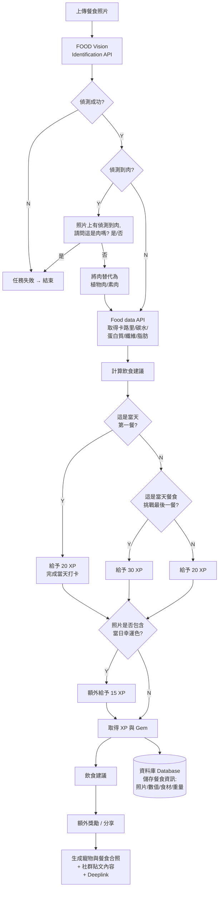

# Yummi Go — User Flow

來源：`Group 4.pdf`（Figma 匯出，單頁大畫布 9544×7282，包含完整流程）

App 主軸：**素食挑戰 + 虛擬寵物 + AI 餐食辨識**。用戶拍餐食照片 → AI 辨識是否含肉 → 通過則獲得 XP/Gem，並養成寵物。

---

## 1. 流程地圖（三段式）

| 段落 | 起點 | 終點 | 備註 |
|---|---|---|---|
| **A. Onboarding** | 啟動畫面 | 設定進食時間 | 首次開啟流程 |
| **B. Login**（替代分支） | Already have account → Log in | 接回 A 後段 | 老用戶捷徑 |
| **C. Daily Check-in** | Home Page | 分享頁/紀錄頁 | 核心日常迴圈 |
| **D. 後端判斷邏輯** | Photo upload | XP/Gem 入帳 | C 段背後的決策樹 |

---

## 2. Onboarding Flow（新用戶）

```
啟動畫面 (Yummi Go Logo)
  ↓
歡迎/Get Started 頁 (Yummi Go Images)
  ↓ ──┐  Already have an account? Log in →【B. Login Flow】
  ↓
用戶飲食習慣調查
  · Vegan 純素 / Vegetarian 蛋奶素 / Flexitarian 有時不吃肉 / Omnivore 無肉不歡 / Skip
  ↓
每天吃肉的頻率
  · all of the meals / 2 meals /day / 1 meal /day / Skip
  ↓
參加挑戰的目的
  · Body management / Environment protection / Make a vow / Skip
  ↓
選擇挑戰類型
  · Vegan 純素 / Vegetarian 蛋奶素 / Flexitarian 有時不吃肉 / Omnivore 無肉不歡 / Skip
  · all of the meals / 2 meals /day / 1 meal /day / Skip
  ↓
動畫說明 (Yummi Go Animation)
  · "You got an egg of OOO, now you will ..."（challenge rule）
  ↓
當日歡迎訊息
  · "Hi, how's it going? Want to share what you ate for your last meal?"
  ↓
餐食辨識入口 (Take a photo / Skip) →【C. Daily Check-in】
  ↓
首次取得 XP 動畫
  · "恭喜用戶獲得 XP + Y"
  ↓
Save Your XP（Google Login）
  · Google Login / 手機 OTP 登入 / Apple 登入 / Skip
  ↓
設定 Username
  ↓
如何得知這個 APP
  · Facebook / Instagram / Threads / 親友分享 / Skip
  ↓
設定進食時間
  ↓
進入 Home Page
```

---

## 3. Login Flow（B 分支）

```
Log in 彈窗
  · Google 登入 / 手機 OTP 登入 / Apple 登入 / 我沒有帳號
  ↓
（成功）→ Home Page
（"我沒有帳號"）→ 接回 Onboarding 起點
```

> 設計上 Login 以 Bottom Sheet 形式呈現，含灰色 grabber、圓角頂部。

---

## 4. Daily Meal Check-in Flow（C 段）

```
Home Page (Yummi Go)
  ↓
拍照（Camera UI：全螢幕預覽、底部圓形拍攝鍵、右上 X）
  ↓
AI 掃描辨識中 ...
  · 放寵物照片 e.g., 趴在底部上面
  ↓
[判斷邏輯詳見第 5 節]
  ↓ 通過
完成打卡動畫："恭喜你完成今天的餐食打卡"（D2 D3 D4 D5 D6 D7 進度）
  ↓
獲得 XP 動畫（依當餐情境四選一）：
  · +20 XP — "太棒了！用蔬食展開新的一天！" 第一餐
  · +20 XP — 第二餐
  · +30 XP — "恭喜你完成今天每餐吃蔬食任務" 第三餐
  · +15 XP — "Lucky！你擁有了今天的幸運色～" 幸運色
  ↓
取得 XP + Gem 圖/動畫（Title）
  ↓
飲食建議 + 卡路里與營養素
  · 453 卡路里
  · 蛋白質 達標 / 纖維 可再多攝取 80 卡 / 脂質 不錯，繼續保持 / 碳水化合物 過量
  · 食材清單：生菜 32g、番茄 120g、小黃瓜 21g、優格 73g、彩色櫻桃蘿蔔 73g
  · 飲食建議文字："我下一餐希望可以吃到更多的 {攝取比例不足的成分} 哦～"
  ↓
分享頁："太棒了！我的完美的蔬食餐" + Share 按鈕
```

### 失敗 / 替代分支

| 觸發 | 畫面文案 | 動作 |
|---|---|---|
| 偵測失敗 | 任務失敗動畫 + "未能成功偵測到照片，請重新拍照" | Try Again |
| 偵測到肉（用戶確認是肉） | "蔬食餐不能有肉 嗚嗚嗚嗚嗚⋯⋯ 一些激勵的話語 ... 邀請用戶繼續完成任務" | Home / Try Again |
| 偵測到肉（用戶說不是肉） | "已將肉替代為植物肉/素肉囉！" | 繼續流程 |
| 通過但提醒下一餐 | "下一餐記得不能吃肉哦～" | — |

---

## 5. 後端判斷邏輯（D 段）



---

## 6. UI Components 清單

從畫布左上角的元件樣本與重複出現的樣式整理：

### 6.1 基礎元件
- **Grabber** — Bottom Sheet 頂部小握把
- **Separator** — 分隔線
- **間距 token** — 8px / 8px / 4px / 4px

### 6.2 Buttons
- **Large Button** — 主要 CTA，黑底白字、膠囊圓角（Continue / Share / Try Again / Get Started）
- **Medium Button**
- **Small Button**
- **Outline Button** — 白底灰框（Skip / "Already have an account? Log in"）
- **Choice Buttons** — 問卷選項，全寬灰色膠囊，垂直排列

### 6.3 結構元件
- **Status Bar (iPhone)** — 頂部 9:41、Dynamic Island、訊號 / Wi-Fi / 電量
- **Navigation Bar** — 含 Back（􀆉 SF Symbol）
- **Step Progress Bar** — 多段水平進度線（黑=當前 / 灰=未完成）
- **Bottom Sheet** — Login、XP/Gem 彈窗，含 grabber 與圓角頂部
- **Home Indicator** — iPhone 底部橫條

### 6.4 內容元件
- **Camera UI** — 全螢幕預覽 + 底部圓形拍攝鍵 + 右上關閉 X
- **Photo Preview Card** — 大張餐點照片，上方/下方有 AI 狀態提示 pill
- **Confirmation Controls** — 是 / 不是 膠囊按鈕（用於確認照片是否含肉）
- **Reward Progress** — D2–D7 小圓點 + 餐次圓形徽章 + ✓ icon
- **Reward Badge** — 紫色圓形 icon（幸運色獎）
- **Nutrition Card** — 白底，列表式顯示營養素 + 克數 + 達標狀態
- **Share Card** — 含分享 icon 的黑底膠囊按鈕

---

## 7. 設計師待確認（原稿紅框註記）

| # | 位置 | 問題 | 選項 |
|---|---|---|---|
| Q1 | 餐食辨識入口前 | 需要考量是否需要這個步驟（用戶當下沒有可拍照的餐食時） | opt1: 純說明動畫；opt2: 動畫 + 讓用戶決定是否使用 |
| Q2 | 設定 Username | 還不會有 Username 嗎？要顯示 Username 還是寵物 name？ | — |
| Q3 | 完成打卡 → 獎勵 | 完成打卡與給予獎勵之間是否需要動畫？ | — |
| Q4 | 幸運色 +15 XP | 需確認每日幸運色的生成邏輯 | — |
| Q5 | XP 獎勵時機 | 每餐都給 XP 嗎？ | — |
| Q6 | 飲食建議 | 生成什麼飲食建議內容？文字？ | — |
| Q7 | 分享時機 | 分享放在這裡還是更早？ | — |
| Q8 | 飲食建議 / 營養分析 | 兩頁拆解？還是合併在下一頁？ | — |

---

## 8. Per-screen 文字索引（速查）

| 畫面 | 主要文字 |
|---|---|
| 啟動 | `Yummi Go` / `Logo` |
| 歡迎 | `Yummi Go` / `Imgaes`（原稿 typo，應為 Images）/ `Get Started` / `Already have an account? Log in` |
| Log in | `Log in` / `Google 登入` / `手機 OTP 登入` / `Apple 登入` / `我沒有帳號` |
| 飲食習慣調查 | `用戶飲食習慣調查` / 4 選項 / `Skip` |
| 吃肉頻率 | `每天吃肉的頻率` / `all of the meals` / `2 meals /day` / `1 meal /day` / `Skip` |
| 挑戰目的 | `參加挑戰的目的` / `Body management` / `Environment protection` / `Make a vow` / `Skip` |
| 挑戰類型 | `選擇挑戰類型` / 4 選項 / `Skip` |
| 動畫說明 | `Yummi Go Animation` / `You got an egg of OOO, now you will .....` / `(challenge rule)` |
| 當日歡迎 | `Daily Welcome` / `Hi, how's it going?` / `Want to share what you ate for your last meal?` |
| 拍照入口 | `Take a photo` / `Skip` |
| 首次 XP | `恭喜用戶獲得 XP + Y` |
| Save XP | `Save Your XP` / Google・手機 OTP・Apple / `Skip` |
| Username | `設定 Username` |
| 來源調查 | `如何得知這個 APP` / Facebook / Instagram / Threads / 親友分享 / `Skip` |
| 進食時間 | `設定進食時間` |
| Home | `Yummi Go` / `Home Page` |
| AI 辨識 | `AI 掃描辨識中 ...` |
| 含肉確認 | `照片上有偵測到肉，請問這是肉嗎？` / `是` / `否`（或：`請問這是肉嗎？` / `是` / `不是`） |
| 任務失敗 | `蔬食餐不能有肉 嗚嗚嗚嗚嗚⋯⋯` / `下一餐記得不能吃肉哦～` / `Home` / `Try Again` |
| 偵測失敗 | `未能成功偵測到照片，請重新拍照` / `Try Again` |
| 替代成功 | `已將肉替代為植物肉/素肉囉！` / `Try Again` |
| 完成打卡 | `恭喜你完成今天的餐食打卡` / D2–D7 / `Continue` |
| +20 XP（首餐） | `+ 20 XP` / `太棒了！用蔬食展開新的一天！` / `第一餐` / `Continue` |
| +20 XP（二餐） | `+ 20 XP` / `第二餐` / `Continue` |
| +30 XP（全日） | `+ 30 XP` / `恭喜你完成今天每餐吃蔬食任務` / `第三餐` / `Continue` |
| +15 XP（幸運色） | `+ 15 XP` / `Lucky！你擁有了今天的幸運色～` / `幸運色` / `Continue` |
| 飲食建議 | `飲食建議` / `蛋白質 達標，你超棒` / `纖維 可以再多攝取 80 卡` / `脂質 不錯，繼續保持` / `碳水化合物 過量，不能再吃了` |
| 卡路里 | `453 卡路里` / `卡路里與營養素` / `單位：卡` / 蛋白質 80 卡 / 纖維 103 卡 / 脂質 20 卡 / 碳水化合物 250 卡 |
| 食材 | `食材` / `單位：克` / 生菜 32 / 番茄 120 / 小黃瓜 21 / 優格 73 / 彩色櫻桃蘿蔔 73 |
| 分享 | `太棒了！我的完美的蔬食餐` / `Share` |
| 下一餐建議 | `我下一餐希望可以吃到更多的 {攝取比例不足的成分} 哦～` |

---

## 附錄：原稿位置

- **流程圖檔案**：`Group 4.pdf`（單頁 9544×7282）/ `Group 4.jpg`（14317×10924）
- **Figma 來源**：`fileKey=YdACLyobo654nHM8GHc2eg`，canvas `node-id=1:6`，第一個 frame `11:550`（Splash 畫面）
- **本 workflow.md 由兩份分析合併**：本機直接讀取 PDF + `codex exec` 並行分析（報告存於 `_codex_group4.md`）
